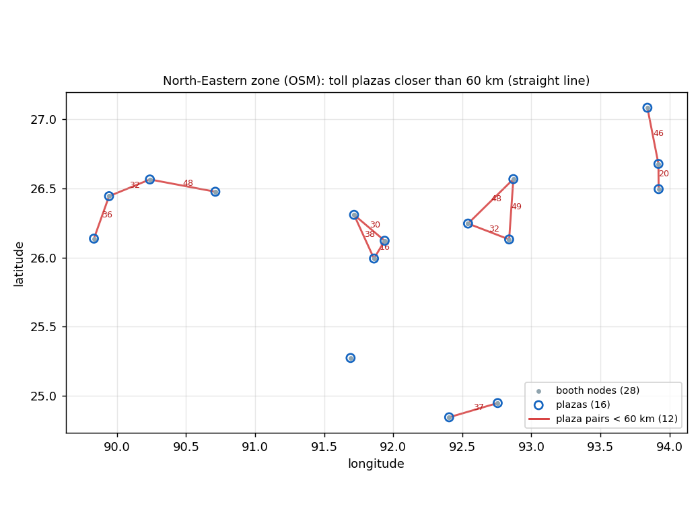

# Toll Plaza Spacing Audit — OpenStreetMap + local LLM verification

Flags national-highway toll plazas that sit closer together than the **60 km** spacing in India's
NH fee rules, using OpenStreetMap data, then checks each suspect plaza against the web with a
locally hosted LLM (Ollama).

**🌐 Live results page: [tanaykohale.github.io/Automated-Toll-Booth-Legality-Validation-Using-Geospatial-and-LLM-Based-Reasoning](https://tanaykohale.github.io/Automated-Toll-Booth-Legality-Validation-Using-Geospatial-and-LLM-Based-Reasoning/)** — interactive map + tables (built from `docs/`).



## Result on the sample region (OSM North-Eastern zone extract)

| Step | Count |
|---|---|
| `barrier=toll_booth` nodes in the extract | 28 (+8 `highway=toll_gantry`) |
| Booth-to-booth pairs < 60 km (original notebook) | 54 |
| …of which are lanes/directions of the **same** plaza (< 1 km apart) | 12 |
| Plazas after clustering booths within 1 km | 16 |
| **Plaza pairs < 60 km (candidates)** | **12** (closest: 16.3 km) |

Outputs: [`examples/plazas.csv`](examples/plazas.csv) · [`examples/pairs.csv`](examples/pairs.csv) ·
[`examples/map.html`](examples/map.html) (interactive Leaflet map — download and open in a browser).

> **Read the numbers carefully.** Distances are straight-line (Haversine). Road distance is always
> longer, so a pair ≥ 60 km apart here is certainly compliant, while a pair < 60 km is a *candidate*
> that still needs a road-distance check. The rule also only applies to plazas on the same highway
> section. OSM data can be incomplete or outdated — that is what the verification step is for.

## Pipeline

```
region.osm ──extract──▶ booths.csv ──pairs──▶ plazas.csv + pairs.csv + map.html ──verify──▶ *_verified.csv
            (lxml stream)          (cluster ≤1 km, Haversine <60 km)        (web search + Ollama)
```

1. **Extract** — stream-parse OSM XML with `lxml.iterparse`, clearing nodes as it goes (flat memory
   on multi-GB files); keep `barrier=toll_booth` and `highway=toll_gantry` nodes.
2. **Cluster** — booths within 1 km (single linkage) become one plaza; centroid + member ids kept.
3. **Pairs** — every plaza pair closer than 60 km, sorted by distance.
4. **Verify** — for each plaza in a pair: search Google in headless Chrome (by name, or
   "toll plaza near lat,lon" when unnamed — most OSM booths have no name), give the page text to a
   local Ollama model to judge whether a real plaza exists, then a second short prompt turns the
   explanation into `0` real / `1` invalid. Pairs with an invalid plaza are dropped.

## Usage

```bash
pip install -r requirements.txt

# 1. get an extract, e.g. https://download.geofabrik.de/asia/india.html  (.osm.pbf)
#    convert to XML with osmconvert (https://wiki.openstreetmap.org/wiki/Osmconvert):
osmconvert north-eastern-zone-latest.osm.pbf -o=north-eastern-zone-latest.osm

python -m tollcheck extract north-eastern-zone-latest.osm -o data/booths.csv
python -m tollcheck pairs data/booths.csv -o output/ --booths-only
# needs Chrome + Ollama running with a model pulled (ollama pull llama3):
python -m tollcheck verify output/plazas.csv output/pairs.csv -o output/ --model llama3
```

Rebuild the static results page (served by GitHub Pages from `docs/`):
```bash
python -m tollcheck site data/booths.csv -o docs --booths-only --region "North-Eastern zone, India"
```

Options: `--km 60` (threshold), `--plaza-radius 1.0` (km), `--booths-only` (ignore gantries).

## Tests

```bash
pip install -r requirements-dev.txt
pytest
```
Offline and fast: a tiny synthetic `.osm`, known Haversine distances, clustering edge cases, a
regression test that reproduces the notebook's 54 raw pairs and the 12 plaza pairs, and the
verification logic with fake search/LLM responses.

## Stack
Python · pandas · lxml · Haversine · Selenium · Ollama (local LLM) · Leaflet

## Repository layout
```
tollcheck/            extract.py · distance.py · verify.py · report.py · site.py · __main__.py (CLI)
docs/                 static results page for GitHub Pages
data/                 north_eastern_zone_booths.csv (sample extract output)
examples/             outputs for the sample region
notebooks/            original exploration notebooks
tests/                pytest suite
```

## Roadmap
- Road-network distance (Dijkstra on the OSM highway graph) for the candidate pairs
- Filter pairs to plazas on the same NH section (`ref` tag of the containing way)
- Run on all Indian zones

License: MIT
